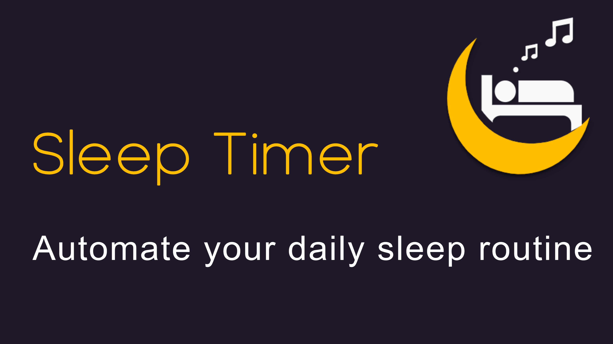
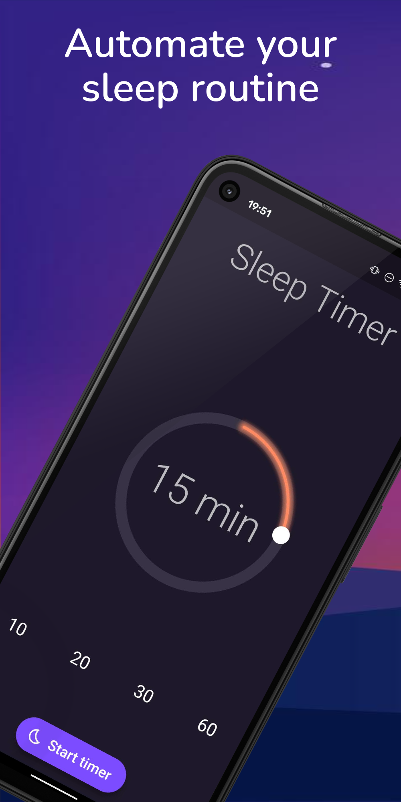
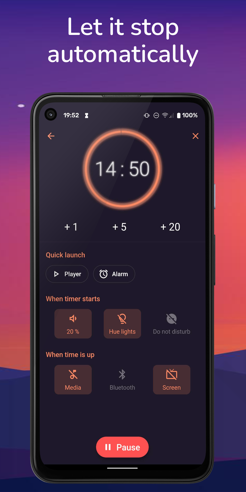
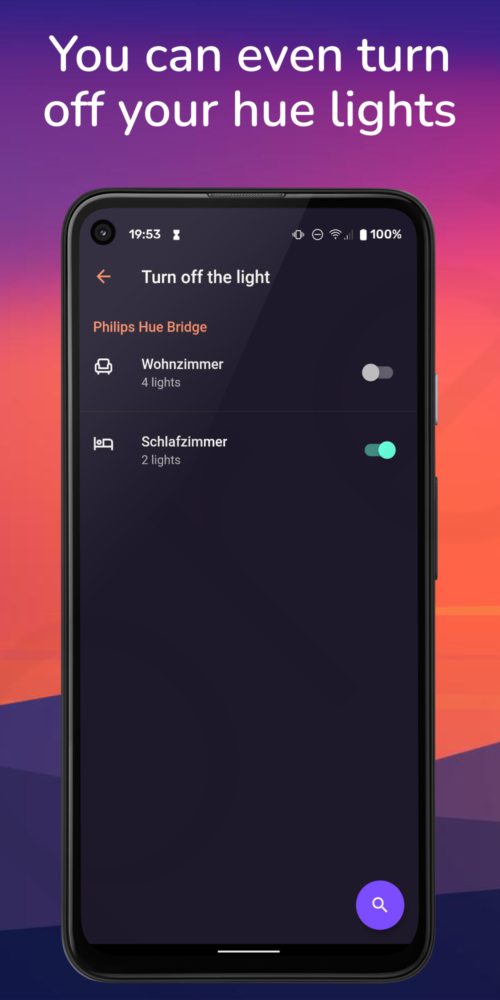

# 

# Comfy Sleep Timer

Turn off your music and video automatically when you fall asleep.

<b>Do you like listening to music or watching a movie while falling asleep?</b>
Comfy Sleep Timer turns it off after the desired time. Works with all popular music and video players such as Spotify, YouTube and many more.

<b>The following actions are supported</b>
* Turn off music
* Turn off bluetooth
* Turn off screen
* Turn off wifi (only for Android 9 and below) 

On timer start
* Set media volume
* Turn off your lights (only with Philips Hue)
* Turn on do not disturb

Additional features
* Quick launch your favorite music or video player
* Quick launch your alarm app
* Extend the timer by shaking your phone
* Extend the timer directly from the notification

<b>Simple and beautiful design</b>
* Choose between different different themes
* Sleek animations

Everything is designed to be easy and pleasent to use.

## Screenshots

  
   
   
   

The Mockups were created by using previewed.app

## Download

[![playstore badge][]][playstore link]

[playstore badge]: https://play.google.com/intl/en_us/badges/images/generic/en-play-badge.png
[playstore link]: https://play.google.com/store/apps/details?id=dr.achim.sleep_timer