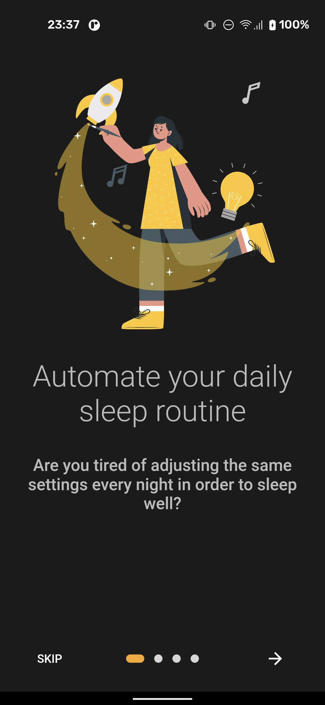
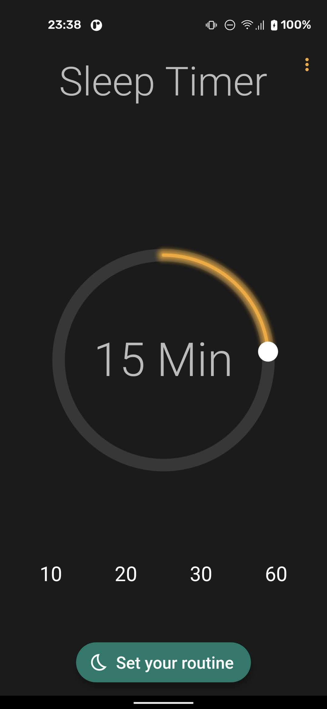
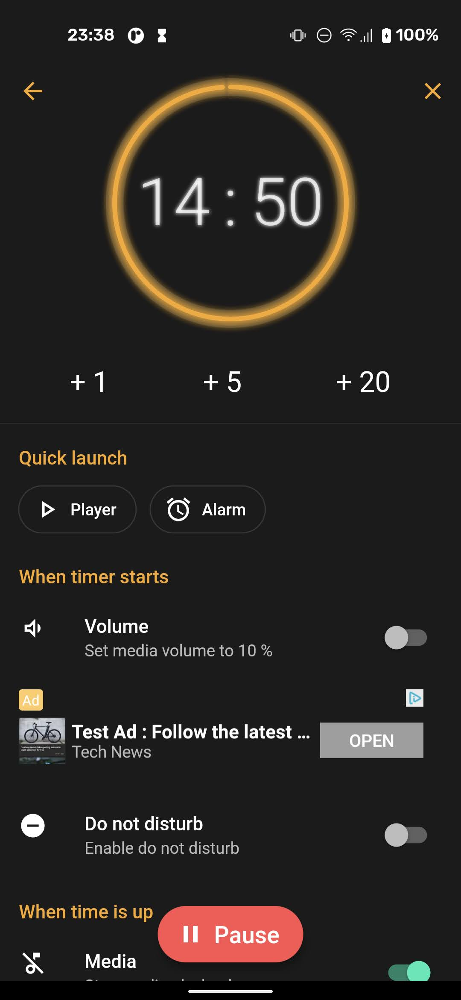

# 

# Comfy Sleep Timer

Comfy Sleep Timer helps you with your daily sleep routine. 
Just start the timer and let it turn everything off after the given time.

<b>Do you like listening to music or watching a movie while falling asleep?</b>

Comfy Sleep Timer turns it off after the desired time. Works with all popular media apps such as Spotify, YouTube, Netflix and many more.

<b>The following actions are supported by now:</b>

On timer start:
* Turn on do not disturb
* Set media volume

When timer ends:
* Turn off music
* Turn off wifi
* Turn off bluetooth
* Turn off screen

Manual actions:
* Extend time
* Quick launch your music and video players
* Quick launch your alarm app

<b>Choose between different themes:</b>
* Light theme
* Dark theme
* Black theme

Everything is designed to be as easy and quick to use as possible.

## Screenshots

<table>
    <tr>
        <td>
            
        </td>
        <td>
            
        </td>
        <td>
            
        </td>
        <td>
            
        </td>
    </tr>
</table>

## Download

[![playstore badge][]][playstore link]

[playstore badge]: https://play.google.com/intl/en_us/badges/images/generic/en-play-badge.png
[playstore link]: https://play.google.com/store/apps/details?id=dr.achim.sleep_timer